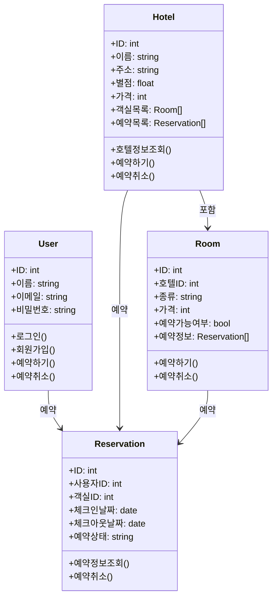
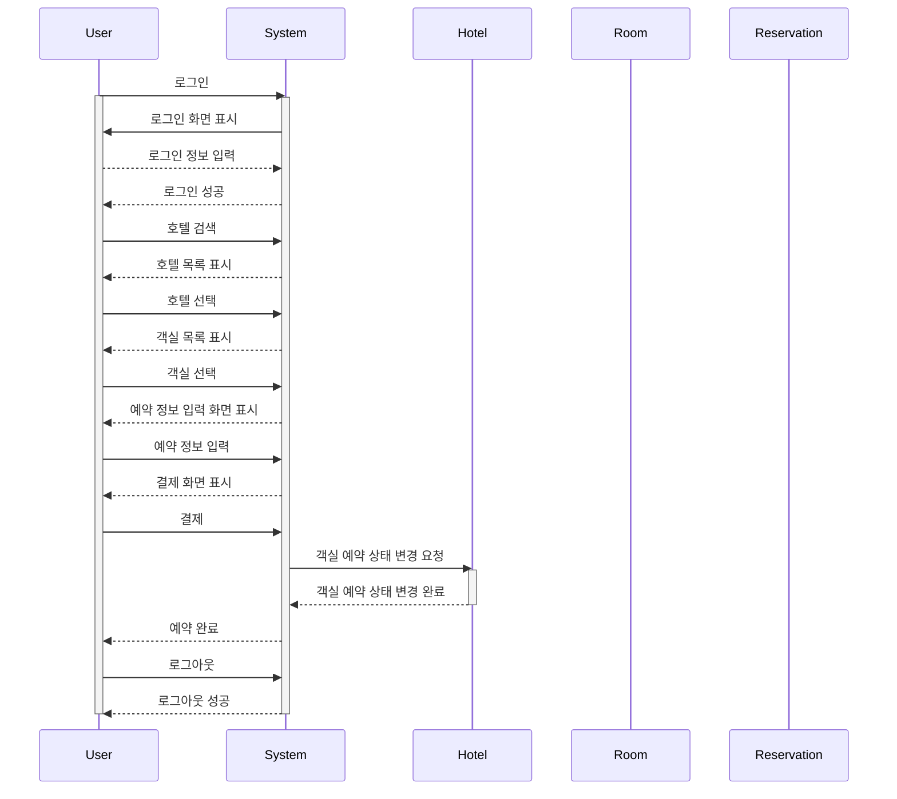

```mermaid
classDiagram
    class User {
        +ID: int
        +이름: string
        +이메일: string
        +비밀번호: string
        +로그인()
        +회원가입()
        +예약하기()
        +예약취소()
    }

    class Hotel {
        +ID: int
        +이름: string
        +주소: string
        +별점: float
        +가격: int
        +객실목록: Room[]
        +예약목록: Reservation[]
        +호텔정보조회()
        +예약하기()
        +예약취소()
    }

    class Room {
        +ID: int
        +호텔ID: int
        +종류: string
        +가격: int
        +예약가능여부: bool
        +예약정보: Reservation[]
        +예약하기()
        +예약취소()
    }

    class Reservation {
        +ID: int
        +사용자ID: int
        +객실ID: int
        +체크인날짜: date
        +체크아웃날짜: date
        +예약상태: string
        +예약정보조회()
        +예약취소()
    }

    User --> Reservation: 예약
    Hotel --> Room: 포함
    Hotel --> Reservation: 예약
    Room --> Reservation: 예약
```

```mermaid
sequenceDiagram
    participant User
    participant System
    participant Hotel
    participant Room
    participant Reservation

    User->>System: 로그인
    activate User
    activate System
    System->>User: 로그인 화면 표시
    User-->>System: 로그인 정보 입력
    System-->>User: 로그인 성공

    User->>System: 호텔 검색
    System-->>User: 호텔 목록 표시

    User->>System: 호텔 선택
    System-->>User: 객실 목록 표시

    User->>System: 객실 선택
    System-->>User: 예약 정보 입력 화면 표시

    User->>System: 예약 정보 입력
    System-->>User: 결제 화면 표시

    User->>System: 결제
    System->>Hotel: 객실 예약 상태 변경 요청
    activate Hotel
    Hotel-->>System: 객실 예약 상태 변경 완료
    deactivate Hotel
    System-->>User: 예약 완료

    User->>System: 로그아웃
    System-->>User: 로그아웃 성공
    deactivate System
    deactivate User
```
